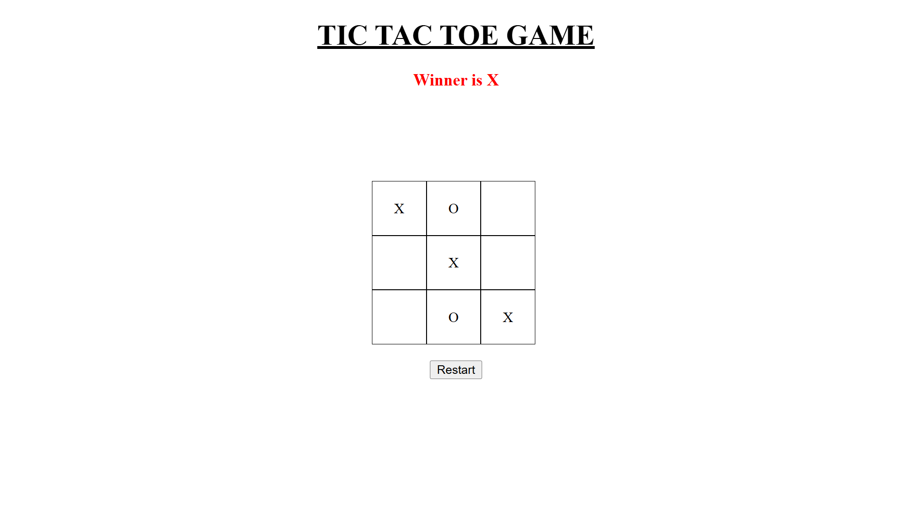

<h1 align="center">✨ Tic Tac Toe Game ✨</h1>

  <b>HTML • CSS • Vanilla JavaScript</b> 
  A classic browser-based game with clean UI and smooth gameplay

  

<h2 align="center">🎯 About the Project</h2>

  This <b>Tic Tac Toe Game</b> is a browser-based implementation of the classic game,
  built to strengthen JavaScript fundamentals, DOM manipulation, and game logic
  without using any external libraries or frameworks.

  ✨ <b>Mission:</b> Build simple projects that improve core programming skills 
  🔥 <b>Approach:</b> Learn → Build → Improve → Repeat

<h2 align="center">🚀 Features</h2>
<ul>
  <li>🎮 Two-player gameplay (X vs O)</li>
  <li>🔄 Displays current player turn</li>
  <li>🏆 Winner detection logic</li>
  <li>🤝 Draw detection when the board is full</li>
  <li>🔁 Restart button to reset the game</li>
  <li>⚡ Built using Vanilla JavaScript</li>
</ul>

<h2 align="center">🛠️ Tech Stack</h2>
<ul>
  <li><b>HTML</b> – Structure of the game</li>
  <li><b>CSS</b> – Styling and layout</li>
  <li><b>JavaScript (Vanilla JS)</b> – Game logic and interactivity</li>
</ul>

<h2 align="center">📂 Project Structure</h2>
<pre>
tic-tac-toe-js/
│
├── index.html
├── style.css
├── script.js
├── screenshot.png
└── README.md
</pre>

<h2 align="center">▶️ How to Run</h2>

<ol>
  <li>Clone the repository</li>
</ol>

<pre>
git clone https://github.com/visheshgupta0404/tic-tac-toe-js.git
</pre>

<ol start="2">
  <li>Open <code>index.html</code> in any modern browser</li>
  <li>Start playing 🎉</li>
</ol>

<h2 align="center">🌱 Learning Outcomes</h2>
<ul>
  <li>Managing game state using arrays</li>
  <li>Implementing conditional logic for win and draw detection</li>
  <li>Handling DOM events efficiently</li>
  <li>Designing clean and user-friendly UI layouts</li>
</ul>

<h2 align="center">🔮 Future Improvements</h2>
<ul>
  <li>Highlight winning combinations</li>
  <li>Add single-player mode (AI)</li>
  <li>Improve animations and UI feedback</li>
  <li>Make the game fully mobile responsive</li>
</ul>

<h2 align="center">👤 Author</h2>

  <b>Vishesh Gupta</b> 
  Frontend Development Enthusiast 
  🔗 <a href="https://github.com/visheshgupta0404" target="_blank">GitHub Profile</a>

<h2 align="center">⭐ Show Your Support</h2>

  If you like this project, consider giving it a ⭐ on GitHub — it really helps!

